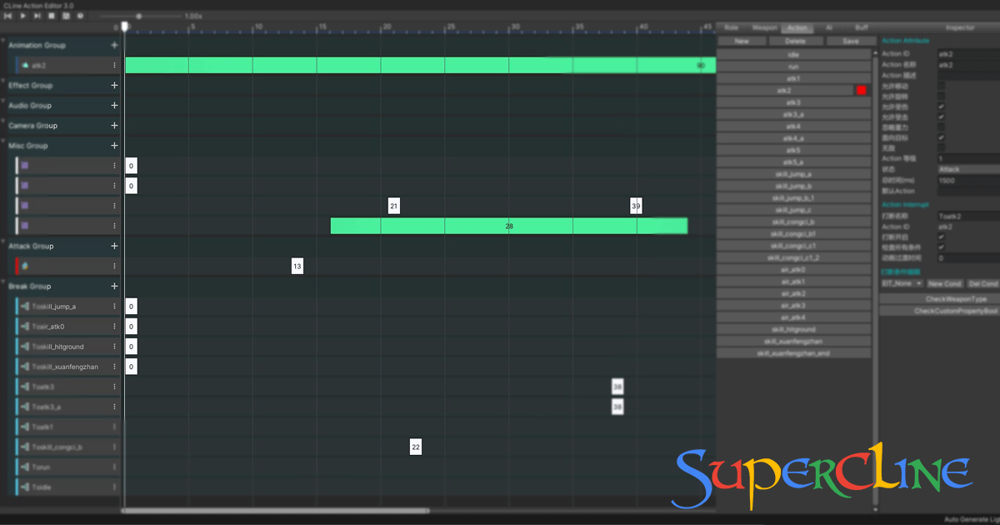
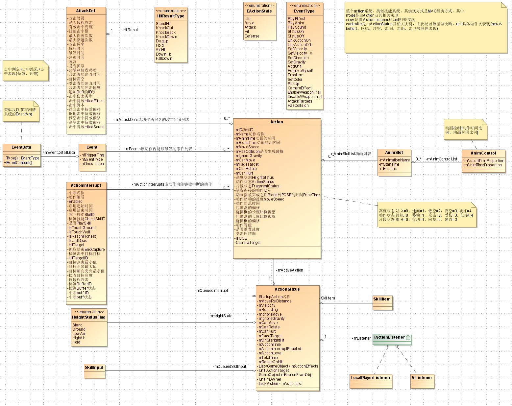

# actioneditor
This project is unity editor plugin for action, skill, AI.

- [Unity Asset Store](https://assetstore.unity.com/packages/slug/154039)
- [官网](https://supercline.com/game/tool-action/actioneditor.html)
- [视频-Bilibili](http://supercline.com/)
- [视频-Youtube](https://youtu.be/DnjRlCCigzM)

# 设计之初心 #
  - 理念是让代码越写越少，Bug才会越来越少，用编辑器可视化工具生成驱动数据
  - 任何游戏的动作技能模块基本是播放动作、特效、音效、相机震屏、抖动、伤害、BUFF、受击效果等，不断迭代提供一个高可用的系统
  - 统一服务端、客户端代码，服务端只管触发和数值伤害计算相关，客户端只管表现相关
  - 框架保证项目执行流程可控性，而算法和数据驱动模型保证项目自由性

# 设计之参考 #
### [Blender Game Engine](https://archive.blender.org/wiki/index.php/Doc:2.6/Manual/Game_Engine/) 
> 编辑器架构来源于Blender引擎的Sensors(传感器即触发器)、Controllers(控制器)、Actuators(执行器)机制，同时采用ECS思想做实现

### [Torchlight Editor](https://torchlight.4fansites.de/download,10010,TorchED_Editor.html)
> 采用反射机制实现Event架构类似火炬之光的数据驱动模型

### 3D Render Pipeline
> 固定管线就是动作技能框架，可编程管线就是数据和算法; Action定义了固定管线，而可编程管线Vertex Shader即Event的派生机制，Pixel Shader即Attack Entity的派生机制和各种运动插值算法派生实现

# 设计之原理 #
### Action
> 包含了动作(Animation)、特效(Effect)、音效(Audio)、相机(Camera)、攻击定义(AttackDef)、Action打断(ActionInterrupt)等Actor元素
### Event
> 包含了事件数据和处理数据的执行逻辑，一个Actor里又包含很多Event元素
### AttackDef
> 包含发射器、攻击定义体(Entity)、攻击定义体属性(EntityComponent)、运动器(Animator)、受击系统(AttackHit)、BUFF伤害数值系统等
### ActionInterrupt
> 本质是当前Action允许被其它Action在不同条件下的触发
### AI
> 本质是基于是一组Action在不同条件下的触发

